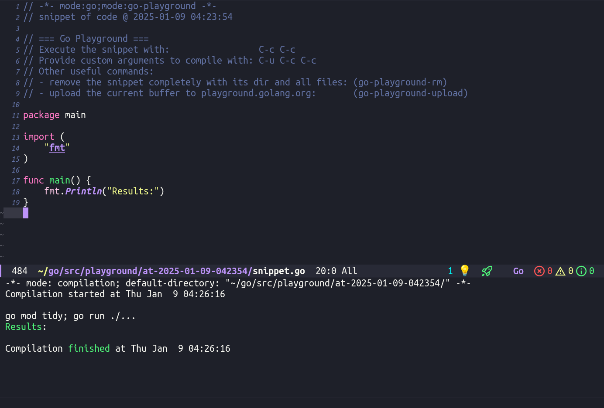

<!--*- mode:markdown;mode:orgtbl;fill-column:99 -*-->
# Local Golang playground [](https://stable.melpa.org/#/go-playground) [](http://melpa.org/#/go-playground)

A simple mode for GNU/Emacs to set up a local [Go language](http://go.dev) playground, offering
features similar to — and in some ways surpassing — the [play.golang.org](http://play.golang.org)
service, thanks to `go-mode`. Treat it as a simple REPL for Go. Unlike `play.golang.org`, this mode
provides a complete local playground within Emacs, eliminating the need for a browser or even
internet connection to experiment with code snippets.

While the web playground at `play.golang.org` is convenient, it comes with restrictions, especially
when using additional tools like linters and code completers. Emacs excels in providing these
tools for Go development, making it more comfortable to work with snippets directly within Emacs.
Setting up a local playground does require configuring the Go environment, but this is necessary
for Go development regardless.

## Features
- Utilizes [go-mode](https://github.com/dominikh/go-mode.el) with all your plugins (like lsp,
  linters, etc.)
- Allows importing external packages
- Maintains a library of snippets under a customizable root path
- Supports multiple source files (or subpackages) for a snippet
- Compatible with Go modules

## Install
First, install `go-mode` and `gotest` — these are mandatory. Set up any additional tools you need for
Go development (see the Emacs Wiki or search for "emacs+golang"). A minimal setup includes
`goimports`, which automatically adds import clauses to your snippets. For a fully functional Go
IDE, consider using `lsp` and supplementary packages.

Install `go-playground` from MELPA:

	M-x package-install RET go-playground

Or:

```
(use-package go-playground)
```

To share snippets, use `go-play-buffer` from `go-mode`. Install `gist-buffer` from MELPA if you
want to publish gists on [github.com](http://github.com).

## Usage

### Quick start

1. Run `M-x go-playground` to start a new playground buffer filled with a basic template for the
   `main` package (see the screenshot below).
1. Add your code and press `Ctl-Return` (bound to `go-playground-exec`), which saves, compiles, and
   executes the snippet.
1. To remove the current snippet and its directory, run `M-x go-playground-rm`.

### List of interactive functions
| Function name            | Bound       | Description                                                                              |
|--------------------------|-------------|------------------------------------------------------------------------------------------|
| `go-playground`          |             | Create a new playground buffer with a basic template for the `main` package.             |
| `go-playground-download` |             | Download a snippet from a URL at [play.golang.org](http://play.golang.org).              |
| `go-playground-exec`     | C-c C-c     | Save, compile, and run the snippet's code.                                               |
| `go-playground-cmd`      | C-u C-c C-c | Save the code and prompt for a command (compile-mode used).                              |
| `go-playground-upload`   |             | Upload the buffer to [play.golang.org](http://play.golang.org) and return the short URL. |
| `go-playground-rm`       |             | Remove the snippet with its directory and all files.                                     |

The mode sets default bindings only for two commands, leaving space for your customizations.

### List of customizable variables
| Variable name                    | Description                                                                                                                                                               |
|----------------------------------|---------------------------------------------------------------------------------------------------------------------------------------------------------------------------|
| `go-playground-ask-filename`     | Ask for the snippet filename on a new playground creation. By default, it's named `snippet.go`.                                                                           |
| `go-playground-basedir`          | Default directory for storing snippets. Each new snippet is placed in a new directory under this path. Place it under GOPATH for organization. Introduced in release 1.1. |
| `go-playground-confirm-deletion` | Confirm before deleting a snippet. You can disable this if it's annoying. Introduced in release 1.2.                                                                      |
| `go-playground-compile-command`  | Customize the compiler command or run additional commands. Default is "go mod tidy; go run ./...".                                                                        |
| `go-playground-init-command`     | Shell command to run once when a new snippet is created.                                                                                                                  |
| `go-playground-compiler-args`    | Arguments passed to the compiler.                                                                                                                                         |
| `go-playground-pre-rm-hook`      | Hook to run before a snippet is removed.                                                                                                                                  |

Example screen after creating a new snippet:



## Using with `lsp-mode`
If you use `lsp-mode`, add a hook to clean up the workspace when a snippet is removed, like this:
```
(defun my/go-playground-remove-lsp-workspace () (when-let ((root (lsp-workspace-root))) (lsp-workspace-folders-remove root)))
(add-hook 'go-playground-pre-rm-hook #'my/go-playground-remove-lsp-workspace)
```
## Snippets with Multiple Files and Subpackages

See [Issue #19](https://github.com/grafov/go-playground/issues/19) for details.

## Similar projects

- [go-scratch](https://github.com/shosti/go-scratch.el) is simpler but restricts tool usage by not
  keeping code in files.
- [gorepl-mode](https://github.com/manute/gorepl-mode) is a REPL for Go, useful for interactive
  code research.

## License

Under terms of GPL v3. See LICENSE file.

## Future plans and accepting contributions

I aim to keep this package simple, leveraging other packages around `go-mode`. Bugfixes and small features are welcome.
